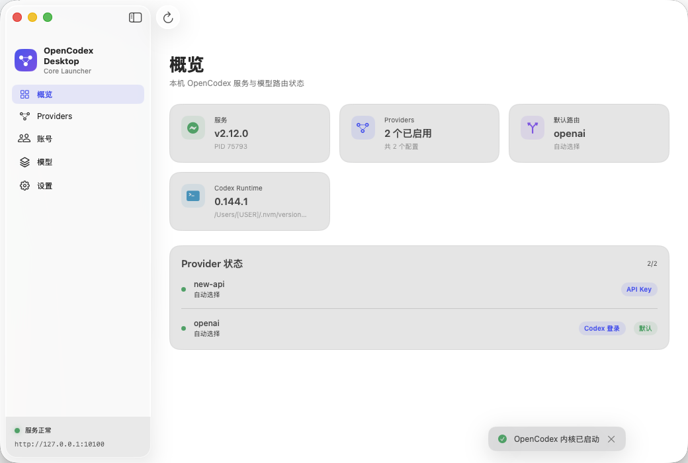
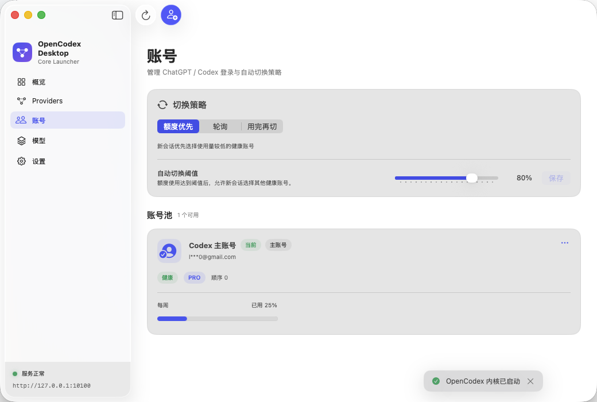
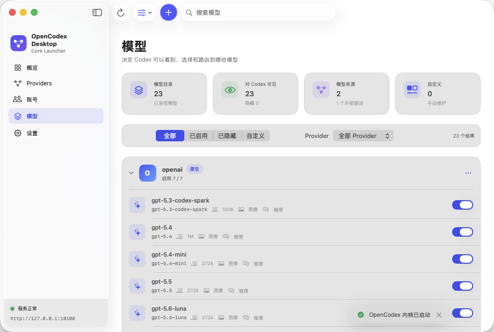

<p align="center">
  <strong>简体中文</strong> · <a href="README.en.md">English</a>
</p>

<div align="center">
  
  <h1>OpenCodex Desktop</h1>
  <p><strong>OpenCodex Core 的原生 macOS 控制台</strong></p>
  <p>
    安装和管理本地内核，在一个简洁的 SwiftUI 界面中完成 Provider、模型与账号池配置。
  </p>
  <p>
    
    
    
    <a href="LICENSE"></a>
  </p>
  <p>
    <a href="https://github.com/leeyang1990/opencodex-desktop/releases">Releases</a>
    · <a href="#界面预览">界面预览</a>
    · <a href="#开发">本地构建</a>
    · <a href="#安全边界">安全设计</a>
  </p>
</div>

---

## 项目简介

OpenCodex Desktop 是独立、轻量的 macOS 启动器，不是 OpenCodex 的源码分支，也不会修改或内置上游项目。应用通过本机管理 API 与 OpenCodex Core 通信，为日常配置和运行维护提供原生桌面体验。

### 核心能力

- **内核生命周期管理** — 安装、启动并检查与客户端兼容的 OpenCodex Core。
- **Provider 配置** — 在图形界面中维护服务提供方与连接参数。
- **模型管理** — 浏览模型目录、维护自定义模型及能力配置。
- **账号池管理** — 查看账号状态与轮换策略。
- **本地优先** — 管理接口仅允许连接回环地址，敏感配置不进入仓库或 App Bundle。
- **可验证安装** — 下载地址固定为 HTTPS，内核、锁文件和运行时均校验 SHA-256。

## 界面预览

<p align="center">
  <a href="Assets/screenshots/overview.png">
    
  </a>
</p>
<p align="center">
  <sub>服务、Provider、默认路由与本地运行时状态一目了然</sub>
</p>

<table>
  <tr>
    <td width="50%">
      <a href="Assets/screenshots/accounts.png">
        
      </a>
    </td>
    <td width="50%">
      <a href="Assets/screenshots/models.png">
        
      </a>
    </td>
  </tr>
  <tr>
    <td align="center">
      <strong>账号池与切换策略</strong><br>
      <sub>查看健康状态、用量，并配置账号轮换</sub>
    </td>
    <td align="center">
      <strong>模型目录与路由</strong><br>
      <sub>按 Provider 筛选模型并控制 Codex 可见性</sub>
    </td>
  </tr>
</table>

## 兼容性

每个桌面端版本只绑定一组经过验证的内核与运行时，不会在运行时跟随未经验证的 `latest` 版本。

| 组件 | 当前版本 |
| :--- | :--- |
| OpenCodex Desktop | `0.5.0` (`4`) |
| OpenCodex Core | `2.12.0` (`6d881db`) |
| Bun | `1.3.14` |
| macOS | `14.0` 或更高版本 |
| 架构 | Apple Silicon（arm64） |

## 工作方式

```text
┌──────────────────────────┐       loopback management API       ┌──────────────────────┐
│  OpenCodex Desktop       │ ◀─────────────────────────────────▶ │  OpenCodex Core      │
│  SwiftUI launcher        │                                     │  pinned + verified   │
└──────────────────────────┘                                     └──────────────────────┘
            │                                                               │
            │ installs runtime                                              │ reads configuration
            ▼                                                               ▼
~/Library/Application Support/                                  ~/Library/Application Support/
OpenCodex Desktop/Core/                                          OpenCodex/Data/
```

桌面端负责安装和运行兼容内核；Provider、账号、令牌等用户数据继续保存在独立数据目录中。升级或卸载内核运行文件不会删除这些配置。

## 开发

### 环境要求

- macOS 14+
- Xcode Command Line Tools
- Swift 5.10+

克隆并验证项目：

```bash
git clone https://github.com/leeyang1990/opencodex-desktop.git
cd opencodex-desktop
swift test
```

生成 Apple Silicon 应用包：

```bash
./scripts/build-app.sh
```

构建结果位于：

```text
dist/OpenCodex Desktop.app
```

构建脚本只打包 Swift 客户端、应用图标和许可文件，不会复制 `vendor/`、OpenCodex 源码、`node_modules` 或 Bun。

### 制作 GitHub Release

发布前先更新 `Info.plist` 中的版本号和构建号，然后在干净的 Git 工作区执行：

```bash
./scripts/release.sh 0.5.0
```

脚本会依次运行测试、构建 Apple Silicon App、验证纯 `arm64` 架构及 ad-hoc 签名，并在 `dist/release/` 生成 GitHub Release 使用的 ZIP 和 SHA-256 文件。它不会打包 Core、运行时、Provider 配置、凭据或日志。

当前发布包使用免费的 ad-hoc 签名，未经 Apple 公证。用户首次启动时可右键应用并选择“打开”；若 Gatekeeper 仍然拦截，在确认下载文件的 SHA-256 与 Release 附件一致后执行：

```bash
xattr -dr com.apple.quarantine "/Applications/OpenCodex Desktop.app"
```

本地验证未提交的修改时可以使用 `--allow-dirty`；正式发布应始终从干净的 tag 构建。

仓库包含自动发布 Workflow。合并版本修改后创建并推送与 `Info.plist` 一致的 tag：

```bash
git tag v0.5.0
git push origin v0.5.0
```

GitHub Actions 会在 macOS ARM runner 上执行同一套测试、构建和校验流程，然后自动创建 GitHub Release、生成更新说明并上传 arm64 ZIP 与 SHA-256 文件。Workflow 不需要签名证书或自定义 Secret，仅使用 GitHub 自动提供且被限制为当前仓库的 token。

## 项目结构

```text
.
├── Assets/                         # 启动器自有视觉资源
├── Sources/OpenCodexDesktop/       # SwiftUI 客户端与内核安装器
├── Tests/OpenCodexDesktopTests/    # XCTest 测试
├── scripts/build-app.sh            # Apple Silicon 打包脚本
├── scripts/release.sh              # Release 校验、归档与校验和
├── Info.plist                      # App Bundle 元数据
├── Package.swift                   # Swift Package 清单
└── THIRD_PARTY_NOTICES.md          # 第三方组件声明
```

如需对照上游 API，可将固定版本源码克隆到已被 Git 忽略的 `vendor/opencodex/`：

```bash
git clone --branch v2.12.0 --single-branch \
  https://github.com/lidge-jun/opencodex.git vendor/opencodex
```

## 本地文件

```text
~/Library/Application Support/OpenCodex Desktop/
├── Core/versions/<version>/    # 独立安装的内核与 Bun
├── Core/cache/                 # 下载缓存
└── Logs/core.log               # 内核运行日志

~/Library/Application Support/OpenCodex/
└── Data/                       # Provider、账号及模型配置
```

## 安全边界

- 管理令牌不会发送到非回环地址。
- API Key、账号标识和请求正文不会被持久化到日志。
- 下载产物必须使用固定 HTTPS 地址和精确摘要。
- 桌面端更新内核前必须明确验证兼容版本。
- 生成的 App、运行时、配置、凭据和日志不会纳入版本控制。

## 许可与第三方组件

OpenCodex Desktop 采用 [MIT License](LICENSE)。OpenCodex Core 是独立的第三方项目，按需从其官方发布渠道下载，并遵循其自身许可。完整信息参见 [THIRD_PARTY_NOTICES.md](THIRD_PARTY_NOTICES.md)。
