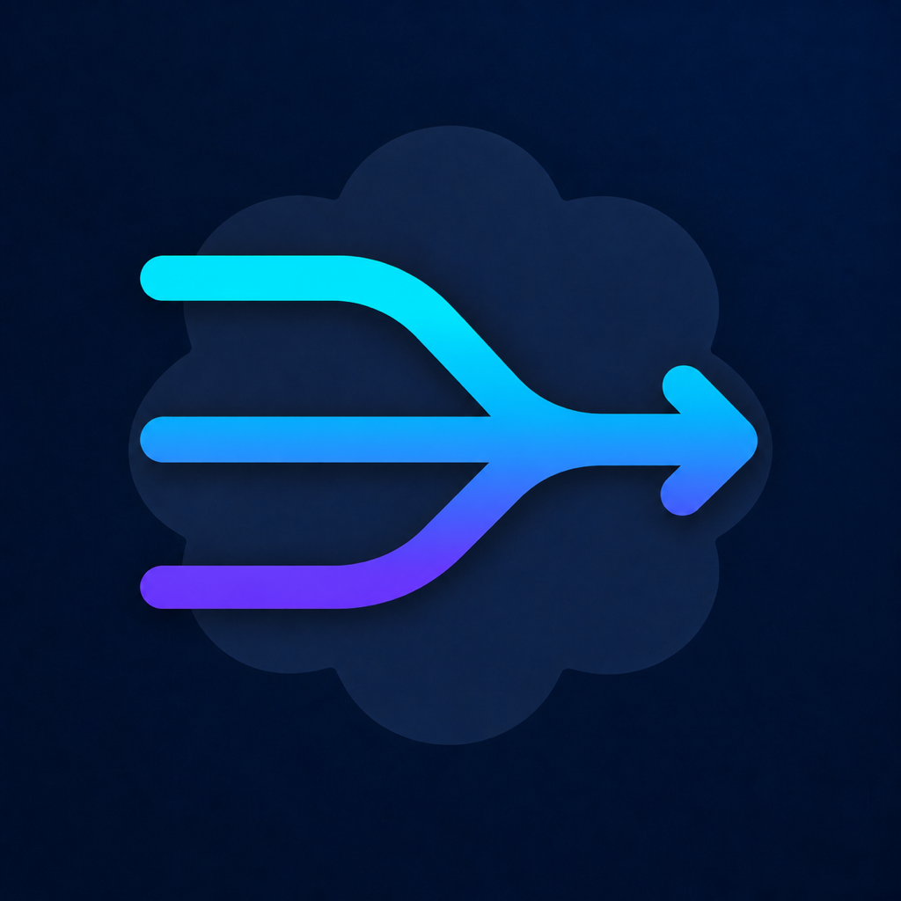
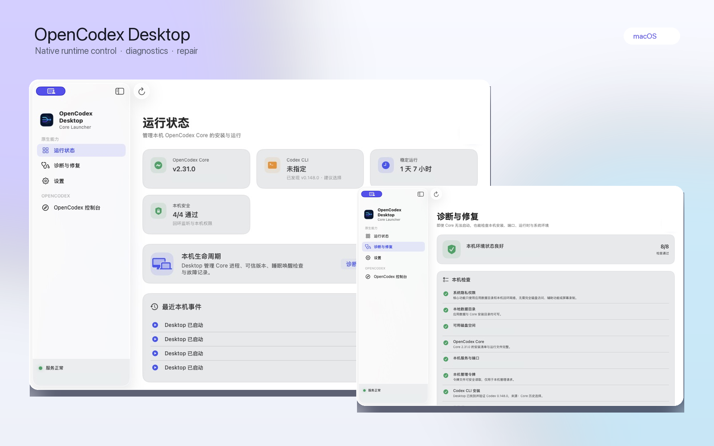

<p align="center">
  <strong>简体中文</strong> · <a href="README.en.md">English</a>
</p>

<div align="center">
  
  <h1>OpenCodex Desktop</h1>
  <p><strong>OpenCodex 的原生 macOS 运行与诊断层</strong></p>
  <p>
    管理本机 Core、Codex CLI、安全检查与系统集成；业务配置交给 OpenCodex 控制台。
  </p>
  <p>
    
    
    
    <a href="LICENSE"></a>
  </p>
  <p>
    <a href="https://github.com/leeyang1990/opencodex-desktop/releases">Releases</a>
    · <a href="#界面预览">界面预览</a>
    · <a href="#开发">本地构建</a>
    · <a href="#安全边界">安全设计</a>
    · <a href="#参与贡献">参与贡献</a>
    · <a href="#致谢">致谢</a>
  </p>
</div>

---

## 项目简介

OpenCodex Desktop 是独立、轻量的 macOS 客户端，不是 OpenCodex 的源码分支，也不会修改或内置上游项目。它专注 Web 页面无法独立完成的本机工作：安装和管理 Core、发现 Codex CLI、执行安全与环境检查、记录脱敏故障事件，并接入菜单栏、通知、登录项与快捷指令。Provider、账号、模型和路由继续由 OpenCodex 控制台统一管理。

### 核心能力

- **本机运行中心** — 集中显示 Core、Codex CLI、运行时长、安全状态和最近事件，并提供明确的启停与重启操作。
- **Codex CLI 管理** — 自动发现 NVM、Homebrew、Codex.app、ChatGPT.app 与 PATH 中的 CLI，默认推荐稳定版本，高级选项中可显式切换；不接触 Codex 登录账号。
- **可信 Core 生命周期** — 安装、启动和检查兼容 Core，保留最近成功版本，并在更新失败时安全回滚。
- **诊断与安全修复** — 即使 Core 离线，也能检查安装完整性、端口、磁盘、令牌权限、监听范围、代码签名、Codex CLI 与登录项。
- **本机故障时间线** — 记录最近 7 天的启动、停止、崩溃、睡眠与唤醒检查事件，不记录账号、Prompt、请求或响应。
- **macOS 原生集成** — 菜单栏、Dock 显示策略、登录项、可选系统通知、App Shortcuts 与 `opencodex://` 安全导航入口。
- **脱敏诊断包** — 导出环境、安全、Codex CLI 和事件结论；不包含凭据、账号标识、请求正文、路径清单或 Core 原始日志。
- **OpenCodex 控制台入口** — 从独立 Tab 打开由 Core 提供的 Provider、账号、模型、日志、用量与集成管理。
- **本地优先** — 管理接口仅允许连接回环地址，敏感配置不进入仓库或 App Bundle。
- **可验证安装** — 下载地址固定为 HTTPS，内核、锁文件和运行时均校验 SHA-256。
- **客户端更新** — 自动检查本仓库的 GitHub Release，只下载精确匹配的 Apple Silicon DMG，并在打开安装镜像前验证 SHA-256。

### 与 OpenCodex 控制台的分工

| OpenCodex Desktop | OpenCodex 控制台 |
| :--- | :--- |
| 可信 Core 安装、启停、更新失败回滚 | Provider、账号、模型与路由管理 |
| 为 Core 发现、验证与选择本机 Codex CLI | Codex 登录与账号池 |
| 安装完整性、端口、安全审计和脱敏诊断 | 日志、用量、集成与运行时业务配置 |
| 菜单栏、通知、登录项、Dock、快捷指令 | Core 提供的跨平台管理界面 |

Desktop 的价值不在于重新实现一套控制台，而在于处理控制台页面无法独立完成的 macOS 安装、更新、诊断修复和原生生命周期集成。原生侧栏只保留运行状态、诊断与修复、OpenCodex 控制台入口和客户端设置。

## 界面预览

<p align="center">
  <a href="Assets/screenshots/native-control-center-v010.png">
    
  </a>
</p>
<p align="center">
  <sub>基于 OpenCodex Desktop 0.10.0 真实界面的代码合成图；仅遮盖本机端口、PID、时间与容量信息</sub>
</p>

## 兼容性

每个桌面端版本只固定使用一组经过验证的内核与运行时，不会在运行时跟随未经验证的 `latest` 版本。

| 组件 | 当前版本 |
| :--- | :--- |
| OpenCodex Desktop | `0.10.0` (`11`) |
| OpenCodex Core | `2.12.0` (`6d881db`) |
| Bun | `1.3.14` |
| macOS | `14.0` 或更高版本 |
| 架构 | Apple Silicon（arm64） |

## 工作方式

```text
┌──────────────────────────┐       loopback management API       ┌──────────────────────┐
│  OpenCodex Desktop       │ ◀─────────────────────────────────▶ │  OpenCodex Core      │
│  SwiftUI launcher        │                                     │  pinned + verified   │
└──────────────────────────┘                                     └──────────────────────┘
            │                                                               │
            │ installs runtime                                              │ reads configuration
            ▼                                                               ▼
~/Library/Application Support/                                  ~/Library/Application Support/
OpenCodex Desktop/Core/                                          OpenCodex/Data/
```

桌面端负责安装和运行兼容内核；Provider、账号、令牌等用户数据继续保存在独立数据目录中。升级或卸载内核运行文件不会删除这些配置。

Core 启动后与桌面窗口生命周期解耦。退出或意外关闭 OpenCodex Desktop 不会终止已经运行的 Core；需要停用代理时，应在客户端中明确点击“停止服务”。

## 开发

### 环境要求

- macOS 14+
- Xcode Command Line Tools
- Swift 5.10+

克隆并验证项目：

```bash
git clone https://github.com/leeyang1990/opencodex-desktop.git
cd opencodex-desktop
swift test
./scripts/check-source-quality.sh
```

生成 Apple Silicon 应用包：

```bash
./scripts/build-app.sh
```

构建结果位于：

```text
dist/OpenCodex Desktop.app
```

构建脚本只打包 Swift 客户端、应用图标和许可文件，不会复制 `vendor/`、OpenCodex 源码、`node_modules` 或 Bun。

### 制作 GitHub Release

发布前先更新 `Info.plist` 中的版本号和构建号，然后在干净的 Git 工作区执行：

```bash
./scripts/release.sh 0.10.0
```

脚本会依次运行测试、构建 Apple Silicon App、验证纯 `arm64` 架构及 ad-hoc 签名，并在 `dist/release/` 生成带“应用程序”快捷方式的 DMG、便携 ZIP 以及两者的 SHA-256 文件。它不会打包 Core、运行时、Provider 配置、凭据或日志。

当前发布包使用免费的 ad-hoc 签名，未经 Apple 公证。用户首次启动时可右键应用并选择“打开”；若 Gatekeeper 仍然拦截，在确认下载文件的 SHA-256 与 Release 附件一致后执行：

```bash
xattr -dr com.apple.quarantine "/Applications/OpenCodex Desktop.app"
```

本地验证未提交的修改时可以使用 `--allow-dirty`；正式发布应始终从干净的 tag 构建。

仓库包含自动发布 Workflow。合并版本修改后创建并推送与 `Info.plist` 一致的 tag：

```bash
git tag v0.10.0
git push origin v0.10.0
```

GitHub Actions 会在 macOS ARM runner 上执行同一套测试、构建和校验流程，然后自动创建 GitHub Release、生成更新说明并上传 arm64 DMG、ZIP 与对应的 SHA-256 文件。Workflow 不需要签名证书或自定义 Secret，仅使用 GitHub 自动提供且被限制为当前仓库的 token。

## 项目结构

```text
.
├── Assets/                         # 启动器自有视觉资源
├── Sources/OpenCodexDesktop/       # SwiftUI 客户端与内核安装器
├── Tests/OpenCodexDesktopTests/    # XCTest 测试
├── scripts/build-app.sh            # Apple Silicon 打包脚本
├── scripts/check-source-quality.sh # Swift 格式和凭据模式检查
├── scripts/release.sh              # Release 校验、归档与校验和
├── docs/API_CONTRACT.md             # 桌面端与 Core 的本地 API 契约
├── CONTRIBUTING.md                  # 贡献与验证流程
├── SECURITY.md                      # 漏洞报告和安全边界
├── CHANGELOG.md                     # 版本变更记录
├── Info.plist                      # App Bundle 元数据
├── Package.swift                   # Swift Package 清单
└── THIRD_PARTY_NOTICES.md          # 第三方组件声明
```

如需对照上游 API，可将固定版本源码克隆到已被 Git 忽略的 `vendor/opencodex/`：

```bash
git clone --branch v2.12.0 --single-branch \
  https://github.com/lidge-jun/opencodex.git vendor/opencodex
```

## 本地文件

```text
~/Library/Application Support/OpenCodex Desktop/
├── Core/versions/<version>/    # 独立安装的内核与 Bun
├── Core/cache/                 # 下载缓存
├── Events/events.json          # 最多 7 天的脱敏本机事件
└── Logs/core.log               # 内核运行日志

~/Library/Application Support/OpenCodex/
└── Data/                       # Provider、账号及模型配置
```

## 安全边界

- 管理令牌不会发送到非回环地址。
- API Key、账号标识和请求正文不会被持久化到日志。
- 事件时间线只接受固定类型的本机生命周期事件，最多保留 7 天，并以当前用户专属权限写入。
- 安全审计检查 Core 的实际监听地址、管理令牌和数据目录权限，以及 App Bundle 签名结构。
- 导出的诊断包只包含本机运行元数据与检查结论，不包含管理令牌内容、账号标识、请求正文或 Core 原始日志。
- 下载产物必须使用固定 HTTPS 地址和精确摘要。
- 桌面端更新内核前必须明确验证兼容版本。
- 客户端更新只接受本仓库正式 GitHub Release 中精确命名的 arm64 DMG，并验证配套 SHA-256 文件后才允许打开。
- 外部登录链接仅允许 OpenAI 与 ChatGPT 官方域名的 HTTPS 地址。
- Core 数据、状态与日志使用仅当前用户可读写的文件权限。
- 生成的 App、运行时、配置、凭据和日志不会纳入版本控制。

## 参与贡献

欢迎提交 Issue 和 Pull Request。开始前请阅读 [贡献指南](CONTRIBUTING.md)、[架构说明](docs/ARCHITECTURE.md)、[安全策略](SECURITY.md) 与 [Core API 契约](docs/API_CONTRACT.md)。用户可见变更会记录在 [CHANGELOG.md](CHANGELOG.md)；安全问题请通过 GitHub 私密漏洞报告渠道提交，不要公开附带密钥、账号标识或未脱敏配置。

## 致谢

OpenCodex Desktop 的核心能力建立在 [OpenCodex](https://github.com/lidge-jun/opencodex) 之上。衷心感谢 OpenCodex 的作者与所有贡献者持续投入时间与精力，为社区提供并维护这一优秀的开源项目。

本项目是独立开发的社区桌面客户端，并非 OpenCodex 官方发行版。我们尊重并感谢上游项目的工作，也欢迎用户关注、使用和支持原项目。

## 许可与第三方组件

OpenCodex Desktop 采用 [MIT License](LICENSE)。OpenCodex Core 是独立的第三方项目，按需从其官方发布渠道下载，并遵循其自身许可。完整信息参见 [THIRD_PARTY_NOTICES.md](THIRD_PARTY_NOTICES.md)。
